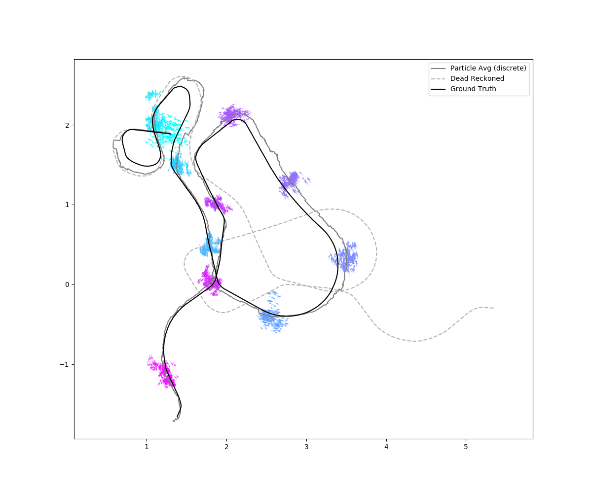
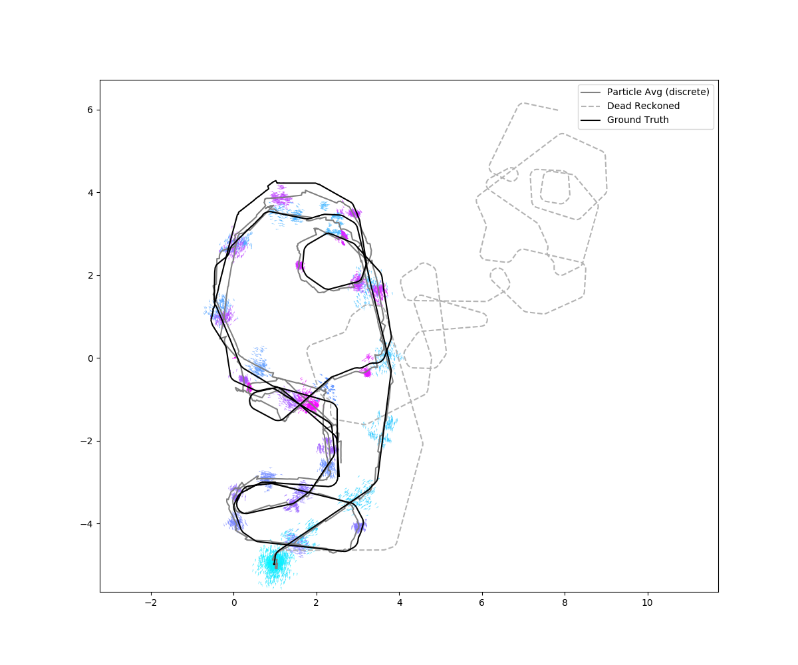

# EECS 495 - Machine Learning and AI for Robotics

Coursework from an audited class at Northwestern.

## hw0 - Filtering Algorithms (Particle Filter)

This homework used data from the Autonomous Space Robotics Lab at the University of Toronto which can be seen here: [http://asrl.utias.utoronto.ca/datasets/mrclam/index.html](http://asrl.utias.utoronto.ca/datasets/mrclam/index.html).

	python run.py [dataset]
	
where dataset = 0 or 1 

### Examples:

