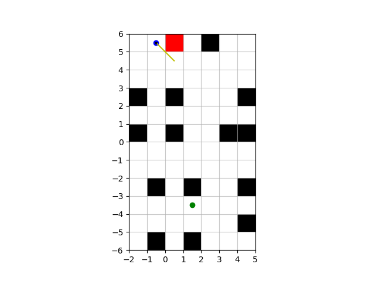

# Assignment #1 - Search and Navigation

## Usage

All simulations run if no `--sim_num` is stated.

```sh
run.py [-h] [--sim_num {0,1,2,3,4,5}] [--animation ANIMATION]

optional arguments:
  -h, --help               show this help message and exit
  --sim_num {0,1,2,3,4,5}  run individual simulation
  --animation ANIMATION    interval between captures for animation
```

## Results

Start and goal position are designated with blue and green dots respectively. The robot pose and path is illustrated by the swept black triangle path. Obstacles begin as black rectangles, but upon being observed, change to the color red.


## Animations




## Concave Environment

There is also a simulation with a concave collection of obstacles to see how the robot would handle such an environment given partial observability.


